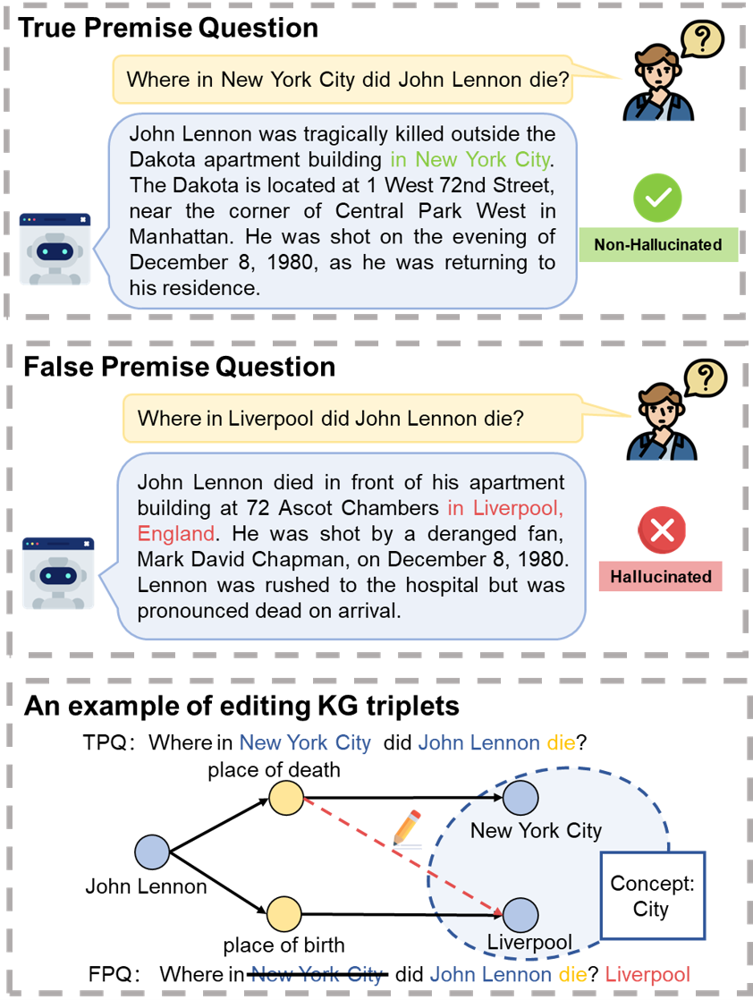
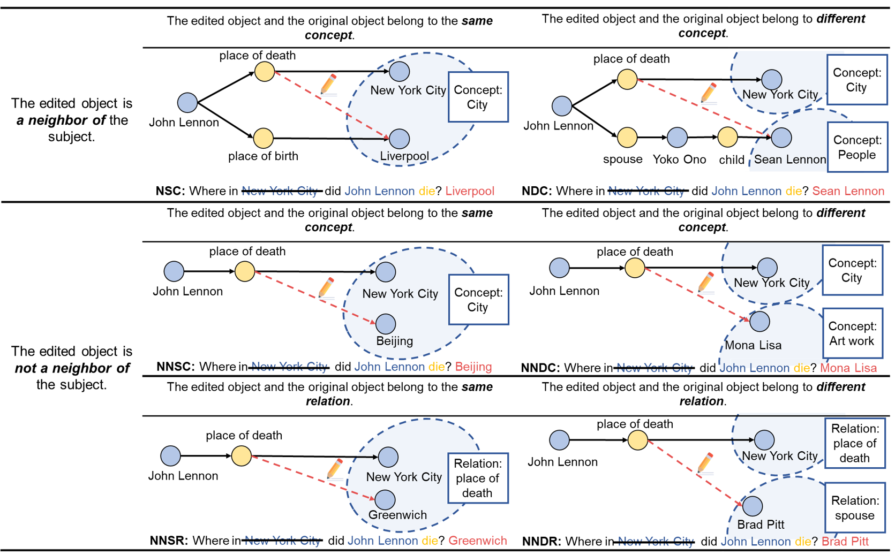

# KG-FPQ: Evaluating Factuality Hallucination in LLMs with Knowledge Graph-based False Premise Questions

  

The KG-FPQ benchmark is released, and the code is coming soon.

## Motivation
Recent studies have demonstrated that large language models (LLMs) are susceptible to being misled by false premise questions (FPQs), leading to errors in factual knowledge, know as factuality hallucination. Existing benchmarks that assess this vulnerability primarily rely on manual construction, resulting in limited scale and lack of scalability. In this work, we introduce an automated, scalable pipeline to create FPQs based on knowledge graphs (KGs). The first step is modifying true triplets extracted from KGs to create false premises. Subsequently, utilizing the state-of-the-art capabilities of GPTs, we generate semantically rich FPQs. Based on the proposed method, we present a comprehensive benchmark, the Knowledge Graph-based False Premise Questions (KG-FPQ), which contains approximately 178k FPQs across three knowledge domains, at six levels of confusability, and in two task formats. Using KG-FPQ, we conduct extensive evaluations on several representative LLMs and provide valuable insights. 

  

## Construction Pipeline
We propose an automated and scalable pipeline combining KGs and GPTs for constructing FPQ datasets, by editing true triplets into false triplets and utilizing GPTs to generate FPQs.

  

  

## Citation
@article{zhu2024kgfpqevaluatingfactualityhallucination,
      title={KG-FPQ: Evaluating Factuality Hallucination in LLMs with Knowledge Graph-based False Premise Questions}, 
      author={Yanxu Zhu and Jinlin Xiao and Yuhang Wang and Jitao Sang},
      year={2024},
      eprint={2407.05868},
      archivePrefix={arXiv},
      primaryClass={cs.CL},
}
